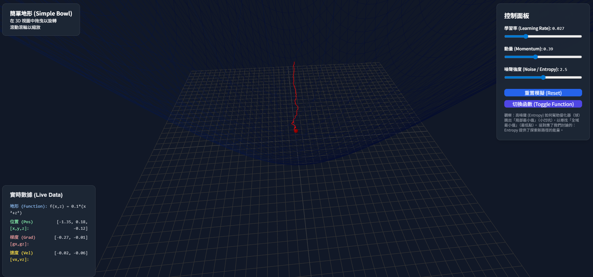

[繁體中文](./README.md)
# 3D Gradient Descent: Visualizing the Probabilistic Landscape of AI ([link](https://shaing.github.io/gradient-descent-3D-simulator/))

This is more than just a 3D Gradient Descent visualization. It's an interactive lab for exploring the core mechanisms behind AI and Large Language Model (LLM) behavior: **Noise and Entropy**.

## This project aims to answer a core question: Why does AI *appear* to be "creative"?

> **Core Concept: AI as a "Structured Probabilistic Landscape + Controlled Stochastic Flow"**

Drawing on insights from Andrej Karpathy and our own discussions, the **"Model Collapse"** seen in AI (e.g., ChatGPT repeating the same three jokes) is a symptom of insufficient `Entropy` during its inference process.

## This tool makes these abstract concepts concrete:

* **3D Landscape:** Represents the AI's "probabilistic distribution" or **"Loss Surface."** The training process is what *sculpts* this terrain.
* **The Red Ball (Optimizer):** Represents the AI's *trajectory* during a single "inference" or "generation" task, as it seeks the optimal answer (the lowest point).
* **The Basins (Valleys):** Represent **"Local Minima"** or "basins of attraction" (i.e., default answers or cognitive inertia). This is where `Model Collapse` happens—the AI gets stuck in a "good enough" but not *optimal* solution.

# How to Use This Experiment

## 1. The Two Landscapes (Functions)

* **Simple Bowl (Convex Function):** This is a "convex" landscape with only one **"Global Minimum."** Any algorithm can easily find the answer here. This represents a simple, "converged" task.
* **Complex Landscape (Non-Convex):** This is the core of the experiment. It's filled with "local minima" (small pits and valleys). This perfectly simulates the complex, multi-faceted knowledge structure of an LLM.

## 2. The Key Parameter: Injecting Entropy

Switch to the **"Complex Landscape"** and run the following two experiments:

### Experiment A: Lack of Entropy (Model Collapse)

1.  Set `Noise / Entropy` to `0`.
2.  Set `Momentum` to a low value (e.g., `0.1`).
3.  Click `Reset Simulation` repeatedly.

**Observation:** The ball starts from different random positions, but it *almost always* rolls into the **nearest** basin and gets stuck. It lacks the energy to overcome the "hills" to find the true global minimum.

**Conclusion:** **This is Model Collapse.** It's the equivalent of setting `Temperature = 0` in an AI. You get a predictable, deterministic, but ultimately uncreative answer.

### Experiment B: Injecting Entropy (AI "Creativity")

1.  Stay on the **"Complex Landscape"**.
2.  Crank the `Noise / Entropy` up (e.g., `2.0` or higher).
3.  Click `Reset Simulation` repeatedly.

**Observation:** The ball starts to "jitter" or "shake" randomly. This noise energy (a random vector added by the `Noise` parameter) constantly "kicks" the ball. This energy is **enough to boot it out of local basins**, letting it jump over hills and explore other regions of the landscape.

**Conclusion:** **This is the power of Entropy.** It's the equivalent of using a `Temperature > 0` with an AI. The injected randomness forces the model to leave its most comfortable (high-probability) path and explore the **"long tail of its knowledge"**—the things it "knows" but doesn't "typically say."

### 3. Other Parameters

* **Learning Rate:** The size of the ball's "steps." Set it too high, and it will "explode" (`Gradient Exploding`) and fly off the map.
* **Momentum:** The ball's "inertia." High momentum also helps it "punch through" small hills, which is another form of exploration (but `Noise` provides the fundamental random source).
* **Data Log:** Watch the `Gradient (Grad) [gx, gz]` values. This is the "pull" of the landscape on the ball. `Noise` works by adding a random vector to this gradient vector before the step is taken.

# Conclusion: Why Does AI Feel "Human"?

We discussed how a `Temperature = 0` output feels "rigid" and "robotic." This simulation reveals the underlying logic:

> A "human-like" answer isn't a sign of consciousness. It's a sign that the output *trajectory* (the ball's path) exhibits **structured randomness**.
>
> This randomness, injected via `Entropy`, prevents its trajectory (the generated text) from getting stuck in a predictable, deterministic basin.
>
> **This visualization proves that what we perceive as AI "creativity" is, in essence, a form of *Controlled Stochasticity*—a guided exploration across a well-trained, *Structured Probabilistic Landscape*.**